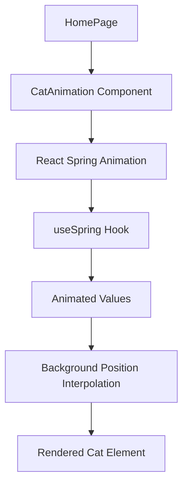

# Feature: Cat React Spring Animation

## Requirements

### User Story

As a website visitor, I want to see a smooth cat animation that uses React Spring instead of sprite-based JavaScript animations, so that I have better performance and visual quality.

### Acceptance Criteria (EARS Syntax)

- The system shall display a cat animation using React Spring instead of the current sprite-based animation
- The system shall maintain the same visual appearance and timing as the current cat animation
- When the animation plays, the system shall use smooth spring-based animations for fluid movement
- The system shall position the cat in the same location (bottom-right corner) as the current implementation
- The system shall integrate react-spring/web seamlessly with the existing component structure
- The system shall maintain accessibility features including proper ARIA labels and test IDs

### Non-Functional Requirements

- Performance: Animation should run at 60fps with no janky frames
- Accessibility: Must maintain current aria-label="cat" and be screen reader friendly
- Compatibility: Must work across modern browsers (Chrome, Firefox, Safari, Edge)

## Design

### Architecture Overview

Replace the current sprite-sheet based animation (`CatAnimation.tsx`) with React Spring animations using react-spring/web for declarative, physics-based animations.



### Components

| Component | Responsibility | Interfaces | Dependencies |
|-----------|---------------|------------|--------------|
| CatAnimation | Render animated cat using React Spring | React props, animated styles | React, Tailwind CSS, @react-spring/web |
| useSpring | Manage spring-based frame animation | Animation values | @react-spring/web |

### Current State Analysis

The existing `CatAnimation.tsx` uses:
- Sprite sheet with 9 frames (3x3 grid)
- 200ms interval between frames
- Manual state management with `useState` and `useEffect`
- Background positioning to show different frames
- Dimensions: 200px × 240px
- Position: `bottom-4 right-[-20]`

### React Spring Implementation

```typescript
const springProps = useSpring({
  from: { frame: 0 },
  to: { frame: 8 },
  config: { duration: 1800 }, // 9 frames * 200ms
  loop: true
})

// Frame-to-position mapping
const getBackgroundPosition = (frame: number) => {
  const frameIndex = Math.floor(frame)
  const row = Math.floor(frameIndex / 3)
  const col = frameIndex % 3
  return `${-col * 200}px ${-row * 240}px`
}
```

### Error Handling

- Fallback to static cat image if React Spring fails to load
- Error boundaries to prevent animation crashes from breaking the page
- Graceful handling of spring animation interruptions

## Test Scenarios

```gherkin
Feature: Cat React Spring Animation @smoke @regression

Scenario: Cat animation displays correctly @smoke
Given the homepage loads
When the loading state completes
Then the cat animation should be visible in the bottom-right corner
And the cat should be animating through its walk cycle

Scenario: Animation performance @regression
Given the cat animation is running
When I monitor the animation frame rate
Then the animation should maintain smooth 60fps performance
And there should be no visual stuttering or jank

Scenario: Accessibility maintained @regression
Given the cat animation is rendered
When I inspect the element with assistive technology
Then it should have aria-label="cat"
And it should have the correct test ID "cat"

Scenario: Animation loop continuity @regression
Given the cat animation is playing
When the animation completes one full cycle
Then it should seamlessly loop back to the beginning
And there should be no visible pause or jump
```

## User Documentation

### Getting Started

1. No user interaction required - animation starts automatically
2. Animation begins after the 300ms loading state
3. Runs continuously in an infinite loop

### Workflows

#### Animation Lifecycle
1. Page loads with loading state
2. After 300ms, components render including CatAnimation
3. Cat animation begins immediately and loops infinitely
4. Animation continues until user navigates away

### Troubleshooting

| Issue | Cause | Resolution |
|-------|-------|------------|
| Animation not smooth | Heavy CPU usage or React Spring config issues | Check browser performance, adjust spring config |
| Cat not visible | CSS positioning issues | Verify Tailwind classes and positioning values |
| Animation too fast/slow | Incorrect spring duration | Adjust spring config duration property |

## Implementation Tasks

- [ ] **Epic 1: Setup React Spring**
    - [ ] Install `@react-spring/web` dependency
    - [ ] Import `useSpring` and `animated` in `CatAnimation.tsx`

- [ ] **Epic 2: Implement React Spring Animation**
    - [ ] Create spring animation for frame interpolation
    - [ ] Map spring frame values to background positions
    - [ ] Replace manual interval-based state management
    - [ ] Use `animated.div` for the cat element
    - [ ] Test animation timing matches original (200ms per frame)

- [ ] **Epic 3: Testing & Optimization**
    - [ ] Update `components/CatAnimation.test.tsx` for React Spring implementation
    - [ ] Add performance tests for 60fps requirement
    - [ ] Test across different browsers and devices
    - [ ] Verify accessibility features remain intact
    - [ ] Run existing test suite to ensure no regressions

- [ ] **Epic 4: Cleanup**
    - [ ] Remove unused sprite animation logic
    - [ ] Update any related documentation
    - [ ] Ensure consistent code style with project standards

## Glossary

- **Spring Animation**: Physics-based animation that simulates spring dynamics for natural motion
- **useSpring**: React Spring hook for creating animated values
- **Animated Values**: Interpolated values that change over time in React Spring
- **Sprite Sheet**: Single image containing multiple animation frames arranged in a grid
- **Frame Rate**: Number of animation frames displayed per second (fps)
- **Animation Loop**: Continuous repetition of an animation sequence