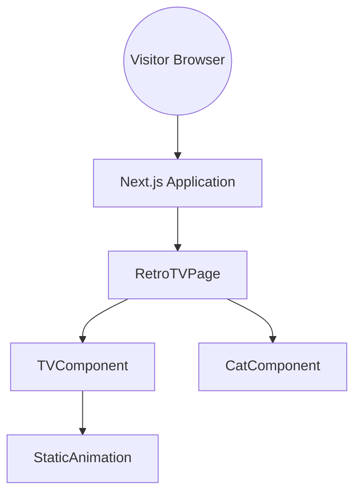
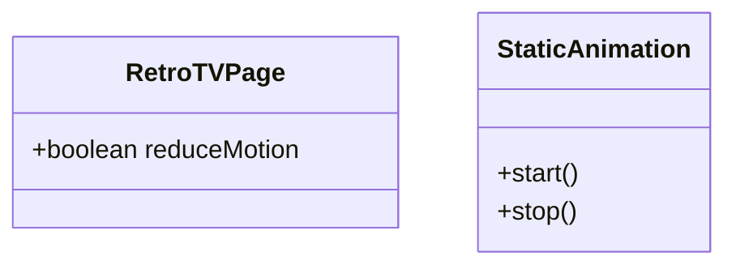

## Overview
The Retro TV Home Page presents a single-screen application where visitors are greeted by a 1950's television set showing animated static with a cat positioned in the foreground. The design prioritizes nostalgia, accessibility, and responsiveness.

## Architecture

The Next.js app renders the `RetroTVPage` at the root route. That page composes `TVComponent` for the television frame and static screen, `CatComponent` for the cat overlay, and `StaticAnimation` for the screen noise.

## Components and Interfaces
| Component        | Responsibility                          | Interfaces    | Dependencies |
|------------------|-----------------------------------------|---------------|--------------|
| RetroTVPage      | Main page layout and responsive styling | Next.js page  | TVComponent, CatComponent |
| TVComponent      | Renders the TV frame and screen content | React props   | StaticAnimation |
| CatComponent     | Displays cat image and optional animation | React props   | None |
| StaticAnimation  | Creates animated static using CSS or canvas | CSS keyframes | None |

## Data Models

## Error Handling
* Failure modes: unsupported CSS features, animation preference settings.
* Recovery: gracefully degrade by substituting static images when animations fail.
* User-visible errors are not expected; decorative assets lack alternative actions.

## Testing Strategy (High-Level)
* Unit test each component rendering.
* Use integration tests to confirm the assembled page loads with all assets.
* Non-functional tests cover performance and accessibility with tools like Lighthouse.

## Edge Cases and Constraints
* Browser lacks CSS animation support.
* Visitor enables `prefers-reduced-motion`.
* Very small screens requiring layout adjustments.

## Design Decisions
| Decision | Alternatives | Chosen | Reason |
|----------|-------------|--------|-------|
| Use CSS keyframes for static animation | GIF animation, Canvas rendering | CSS keyframes | Lightweight and easy to control with reduced motion settings |
| Cat tail animation optional | Always animated | Optional | Respects user motion preferences |

## Glossary
* Retro TV: A stylized television set reminiscent of the 1950s.
* Static Animation: Visual effect simulating analog signal noise.
