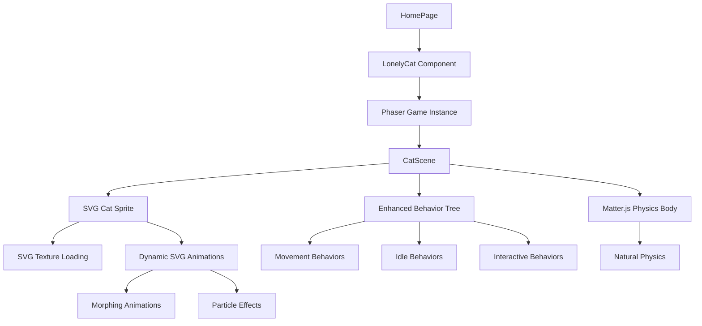

# Feature: Natural Interactive SVG Cat

## Requirements

### User Story

As a website visitor, I want to interact with a natural-looking SVG cat that responds to my actions with lifelike behaviors, so that I have an engaging and delightful experience.

### Acceptance Criteria (EARS Syntax)

- The system shall display a cat as a custom SVG texture within the existing Phaser framework
- The system shall enable the cat to move naturally using Matter.js physics
- When I click near the cat, the system shall make the cat approach the clicked location using existing behavior trees
- When I hover over the cat, the system shall trigger responsive animations (purring, eye blinking, tail movement)
- While idle, the cat shall perform natural behaviors (grooming, stretching, looking around) via behavior3js
- When the cat reaches a target, the system shall transition to contextual idle animations
- If I don't interact for 30 seconds, the cat shall enter sleep mode with breathing animations
- The system shall maintain smooth 60fps performance within Phaser's rendering pipeline
- The system shall preserve accessibility with proper ARIA labels on the Phaser canvas

### Non-Functional Requirements

- Performance: All animations must run at 60fps within Phaser's game loop
- Accessibility: Proper canvas labeling and keyboard event handling
- Responsiveness: Adapts to different screen sizes while maintaining proportions
- Browser Support: Modern browsers supported by Phaser.js (Chrome 90+, Firefox 88+, Safari 14+, Edge 90+)

## Design

### Architecture Overview

Enhance the existing Phaser-based game with SVG-textured sprites and expanded behavior trees for more natural cat interactions.



### Components

| Component | Responsibility | Interfaces | Dependencies |
|-----------|---------------|------------|--------------|
| LonelyCat | Enhanced Phaser game component | React lifecycle, canvas events | React, Phaser.js, behavior3js |
| CatScene | Phaser scene with cat sprite and behaviors | Phaser scene API, input events | Phaser.js, Matter.js, behavior3js |
| SVGCatSprite | Custom Phaser sprite using SVG texture | Phaser sprite API, animation methods | Phaser.js, SVG texture loading |
| EnhancedBehaviorTree | Extended behavior system for natural actions | behavior3js API, custom actions | behavior3js |
| SVGTextureManager | Handles dynamic SVG generation and caching | Texture creation, SVG morphing | Phaser.js texture API |

### SVG Cat Design

Replace sprite sheet with dynamically generated SVG textures featuring:

**Anatomical Structure:**
- **Head**: Triangular ears (rotatable), almond eyes (blinkable), pink nose, whiskers
- **Body**: Rounded torso with chest marking, four legs with paws  
- **Tail**: Segmented for natural curved movement
- **Details**: Fur texture via SVG patterns, color variations

**Phaser Texture Generation:**
```typescript
// Generate SVG texture for different cat states
class SVGCatTextures {
  generateIdleTexture(frame: number): string {
    return `<svg width="200" height="240" xmlns="http://www.w3.org/2000/svg">
      <g id="cat-idle-${frame}">
        <g id="tail" transform="rotate(${Math.sin(frame * 0.1) * 10})">
          <path d="M150,200 Q170,180 160,160" stroke="#8B4513" stroke-width="12"/>
        </g>
        <ellipse id="body" cx="100" cy="160" rx="50" ry="40" fill="#D2B48C"/>
        <circle id="head" cx="100" cy="100" r="35" fill="#D2B48C"/>
        <g id="ears">
          <path d="M80,80 L90,60 L100,80" fill="#D2B48C"/>
          <path d="M100,80 L110,60 L120,80" fill="#D2B48C"/>
        </g>
        <g id="eyes">
          <ellipse cx="90" cy="95" rx="6" ry="${8 + Math.sin(frame * 0.05) * 2}" fill="#000"/>
          <ellipse cx="110" cy="95" rx="6" ry="${8 + Math.sin(frame * 0.05) * 2}" fill="#000"/>
        </g>
      </g>
    </svg>`
  }
  
  generateMovingTexture(velocity: {x: number, y: number}): string {
    // Dynamic SVG based on movement direction and speed
  }
}

### Enhanced Behavior System

**Extended Behavior Tree Structure (building on existing):**
```
Root (Priority) - extends current b3.Priority
├── Emergency Behaviors (new)
│   ├── Avoid Boundaries
│   └── Return to Safe Zone
├── Interactive Behaviors (enhanced)
│   ├── MoveToTarget (existing - enhanced)
│   ├── RespondToHover (new)
│   ├── FollowCursor (new)
│   └── ReactToProximity (new)
├── Autonomous Behaviors (new)
│   ├── GroomingSequence (new)
│   ├── StretchingAnimation (new)
│   ├── CuriosityExploration (new)
│   └── SleepModeTransition (new)
└── Idle Behaviors (enhanced)
    ├── Wander (existing - enhanced)
    ├── SubtleBreathing (new)
    ├── OccasionalBlinks (new)
    └── TailIdleSway (new)
```

**Enhanced behavior3js Actions:**
```typescript
// Enhanced MoveToTarget with natural movement
const EnhancedMoveToTarget = class extends b3.Action {
  tick(tick: b3.Tick<any>) {
    const scene = tick.target as CatScene
    const target = scene.blackboard.get('target', scene.tree.id)
    const cat = scene.cat
    
    // Add anticipation animation before movement
    if (!scene.blackboard.get('anticipationStarted', scene.tree.id)) {
      scene.showAnticipationAnimation(cat, target)
      scene.blackboard.set('anticipationStarted', true, scene.tree.id)
      return b3.RUNNING
    }
    
    // Natural acceleration/deceleration
    const dx = target.x - cat.x
    const dy = target.y - cat.y
    const dist = Math.hypot(dx, dy)
    
    if (dist < 10) {
      cat.setVelocity(0, 0)
      scene.transitionToIdleAnimation()
      scene.blackboard.set('target', null, scene.tree.id)
      scene.blackboard.set('anticipationStarted', false, scene.tree.id)
      return b3.SUCCESS
    }
    
    // Natural movement with momentum
    const maxSpeed = 3
    const acceleration = 0.1
    const currentSpeed = Math.hypot(cat.body.velocity.x, cat.body.velocity.y)
    const targetSpeed = Math.min(maxSpeed, dist * 0.05)
    
    const newSpeed = Math.min(currentSpeed + acceleration, targetSpeed)
    cat.setVelocity((dx / dist) * newSpeed, (dy / dist) * newSpeed)
    
    return b3.RUNNING
  }
}
```

### Animation System

**Phaser Animation Integration:**
```typescript
// Enhanced CatScene with natural animations
class CatScene extends Phaser.Scene {
  svgTextureManager!: SVGTextureManager
  animationState = {
    blinkTimer: 0,
    breathingPhase: 0,
    tailSwayPhase: 0,
    lastInteraction: Date.now()
  }

  create() {
    // Initialize SVG texture manager
    this.svgTextureManager = new SVGTextureManager(this)
    
    // Create cat sprite with dynamic SVG texture
    this.cat = this.matter.add.sprite(400, 300, 'cat-idle-0')
    this.cat.setFixedRotation()
    
    // Create enhanced animations
    this.createEnhancedAnimations()
    
    // Setup behavior tree with new actions
    this.setupEnhancedBehaviorTree()
  }

  update(time: number, delta: number) {
    // Update animation state
    this.updateNaturalAnimations(time, delta)
    
    // Run behavior tree (existing)
    this.tree.tick(this, this.blackboard)
    
    // Update SVG texture based on current state
    this.updateDynamicTexture()
  }

  updateNaturalAnimations(time: number, delta: number) {
    // Breathing animation
    this.animationState.breathingPhase += delta * 0.001
    const breathingScale = 1 + Math.sin(this.animationState.breathingPhase) * 0.02
    this.cat.setScale(breathingScale)
    
    // Blinking
    this.animationState.blinkTimer += delta
    if (this.animationState.blinkTimer > 3000 + Math.random() * 2000) {
      this.triggerBlinkAnimation()
      this.animationState.blinkTimer = 0
    }
    
    // Tail sway during idle
    if (this.cat.body.velocity.x === 0 && this.cat.body.velocity.y === 0) {
      this.animationState.tailSwayPhase += delta * 0.002
      const tailRotation = Math.sin(this.animationState.tailSwayPhase) * 15
      this.updateTailRotation(tailRotation)
    }
  }
}
```

### Enhanced Interaction Patterns

**Phaser Input Handling (extends existing click-to-move):**
```typescript
// Enhanced input handling in CatScene
create() {
  // Existing click handler enhanced
  this.input.on('pointerdown', (pointer: Phaser.Input.Pointer) => {
    this.blackboard.set('target', { x: pointer.worldX, y: pointer.worldY }, this.tree.id)
    this.animationState.lastInteraction = Date.now()
  })

  // New hover detection
  this.input.on('pointermove', (pointer: Phaser.Input.Pointer) => {
    const distance = Phaser.Math.Distance.Between(
      pointer.worldX, pointer.worldY, this.cat.x, this.cat.y
    )
    
    if (distance < 100) {
      this.blackboard.set('userProximity', true, this.tree.id)
      this.blackboard.set('cursorPosition', { x: pointer.worldX, y: pointer.worldY }, this.tree.id)
    } else {
      this.blackboard.set('userProximity', false, this.tree.id)
    }
  })
  
  // Keyboard accessibility via Phaser input
  this.input.keyboard?.on('keydown-SPACE', () => {
    this.triggerRandomBehavior()
  })
}
```

**Canvas Accessibility Enhancement:**
```typescript
// In LonelyCat component
useEffect(() => {
  if (containerRef.current) {
    const canvas = containerRef.current.querySelector('canvas')
    if (canvas) {
      canvas.setAttribute('aria-label', 'Interactive cat game - click to guide cat movement')
      canvas.setAttribute('role', 'application')
      canvas.setAttribute('tabindex', '0')
    }
  }
}, [])

### Enhanced Matter.js Physics

**Natural Movement with existing Matter.js:**
```typescript
// Enhanced physics in CatScene
setupPhysics() {
  // Use existing Matter.js setup, enhance with natural characteristics
  this.matter.world.setBounds()
  
  // Configure cat physics body for natural movement
  this.cat.setFriction(0.8) // Natural friction for realistic stopping
  this.cat.setFrictionAir(0.05) // Air resistance
  this.cat.setBounce(0.1) // Slight bounce for weight simulation
  
  // Enhanced boundary handling
  this.matter.world.on('collisionstart', (event) => {
    event.pairs.forEach(pair => {
      if (pair.bodyA === this.cat.body || pair.bodyB === this.cat.body) {
        this.handleBoundaryCollision()
      }
    })
  })
}

// Natural acceleration with Matter.js
applyNaturalMovement(targetX: number, targetY: number) {
  const dx = targetX - this.cat.x
  const dy = targetY - this.cat.y
  const distance = Math.hypot(dx, dy)
  
  if (distance > 10) {
    // Natural acceleration curve
    const force = Math.min(0.005, distance * 0.0001)
    const normalizedX = dx / distance
    const normalizedY = dy / distance
    
    this.cat.applyForce({ x: normalizedX * force, y: normalizedY * force })
  }
}
```

### Error Handling

- **SVG Loading Failures**: Fallback to simple geometric cat shape
- **Animation Performance Issues**: Automatic quality reduction on low-end devices
- **Behavior Tree Errors**: Safe fallback to basic idle animations
- **Touch/Mouse Event Conflicts**: Proper event delegation and cleanup

## Test Scenarios

```gherkin
Feature: Natural Interactive SVG Cat @smoke @regression

Scenario: SVG cat renders correctly @smoke
Given the homepage loads
When the cat component initializes
Then an SVG cat should be visible in the viewport
And the cat should have proper proportions and coloring
And all body parts should be positioned correctly

Scenario: Click-to-move interaction @smoke
Given the cat is in idle state
When I click on a location 200px away from the cat
Then the cat should orient toward the target
And smoothly move to the clicked location
And transition to idle animation upon arrival

Scenario: Hover responsiveness @regression
Given the cat is visible
When I hover my cursor over the cat
Then the cat's ears should perk up
And eyes should track toward the cursor
And subtle purring animation should begin

Scenario: Autonomous behavior cycle @regression
Given the cat has been idle for 10 seconds
When no user interaction occurs
Then the cat should initiate grooming behavior
Or perform stretching animation
Or explore nearby area randomly
And return to idle state after completion

Scenario: Sleep mode activation @regression
Given no user interaction for 30 seconds
When the cat enters sleep mode
Then eyes should close gradually
And body should curl into sleeping position
And breathing animation should slow down
And cat should wake up on next interaction

Scenario: Performance under stress @regression
Given multiple rapid interactions
When I perform 20 clicks in 5 seconds
Then animation frame rate should remain above 50fps
And all behaviors should queue properly
And no animation glitches should occur

Scenario: Accessibility compliance @regression
Given the cat is rendered
When using keyboard navigation
Then the cat should be focusable with Tab
And space bar should trigger interaction
And screen readers should announce "Interactive cat"
```

## User Documentation

### Getting Started

1. **Prerequisites**: Modern browser with SVG and CSS animation support
2. **Access**: Cat appears automatically on page load
3. **First Interaction**: Click anywhere to see the cat move

### Workflows

#### Basic Interaction
1. **Click to Guide**: Click anywhere on screen to direct cat movement
2. **Hover for Attention**: Move cursor over cat for responsive animations
3. **Observe Autonomy**: Watch natural behaviors during idle periods

#### Advanced Interaction
1. **Behavior Triggering**: Different click distances trigger different responses
2. **Contextual Animations**: Cat behavior adapts to location and recent activities
3. **Sleep Cycle**: Extended idle periods activate sleep mode

#### Accessibility
1. **Keyboard Control**: Use Tab to focus, arrows to guide, space to interact
2. **Screen Reader**: Cat announces its current state and available actions
3. **Motor Accessibility**: Large interaction zones, forgiving click targets

### Troubleshooting

| Issue | Cause | Resolution |
|-------|-------|------------|
| Cat not responding | JavaScript errors or blocked | Check browser console, refresh page |
| Jerky animations | Performance limitations | Reduce browser tab count, close other apps |
| Cat disappearing | Viewport size issues | Resize window or refresh page |
| No hover effects | Touch device | Use tap interactions instead |
| Slow performance | Low-end device | Automatic quality reduction should activate |

## Implementation Tasks

- [ ] **Epic 1: SVG Texture System**
    - [ ] Create SVGTextureManager class for Phaser
    - [ ] Design detailed SVG cat with animatable parts
    - [ ] Implement dynamic SVG generation based on cat state
    - [ ] Add SVG texture caching for performance
    - [ ] Test SVG-to-Phaser texture conversion

- [ ] **Epic 2: Enhanced Behavior Tree**
    - [ ] Extend existing behavior3js implementation
    - [ ] Add new behavior actions (grooming, stretching, sleep mode)
    - [ ] Enhance MoveToTarget with anticipation and natural movement
    - [ ] Implement proximity detection and hover response behaviors
    - [ ] Add sleep mode transition after 30 seconds of inactivity

- [ ] **Epic 3: Natural Animation System**
    - [ ] Add breathing animation to existing Phaser sprite
    - [ ] Implement blinking with random intervals
    - [ ] Create tail sway animation during idle periods
    - [ ] Add anticipation animations before movement
    - [ ] Develop grooming and stretching animation sequences

- [ ] **Epic 4: Enhanced Physics**
    - [ ] Configure Matter.js for natural cat movement characteristics
    - [ ] Implement realistic acceleration/deceleration curves
    - [ ] Add friction and air resistance for natural stopping
    - [ ] Enhance boundary collision handling
    - [ ] Create weight simulation with subtle bounce effects

- [ ] **Epic 5: Interaction Enhancements**
    - [ ] Add hover detection to existing Phaser input system
    - [ ] Implement proximity-based alertness behaviors
    - [ ] Enhance accessibility with proper canvas labeling
    - [ ] Add keyboard controls for cat interaction
    - [ ] Create contextual animation responses

- [ ] **Epic 6: Performance Optimization**
    - [ ] Optimize SVG texture generation and caching
    - [ ] Monitor Phaser performance with enhanced animations
    - [ ] Implement quality adjustment for low-end devices
    - [ ] Test memory usage of dynamic SVG textures
    - [ ] Ensure 60fps performance in Phaser game loop

- [ ] **Epic 7: Testing and Integration**
    - [ ] Update existing LonelyCat.test.tsx for new behaviors
    - [ ] Add Playwright tests for interaction patterns
    - [ ] Test accessibility features with screen readers
    - [ ] Performance testing across different devices
    - [ ] Integration testing with existing Phaser/Matter setup

- [ ] **Epic 8: Polish and Documentation**
    - [ ] Replace cat-sprites.png with dynamic SVG system
    - [ ] Update component documentation and comments
    - [ ] Clean up unused sprite animation code
    - [ ] Optimize behavior tree structure for performance
    - [ ] Add error handling for SVG generation failures

## Glossary

- **Behavior Tree**: AI decision-making structure that determines cat actions based on conditions
- **Spring Animation**: Physics-based animation that simulates natural motion with momentum
- **SVG Morphing**: Smooth transformation between different SVG shapes or positions
- **Transform Origin**: Point around which SVG transformations (rotation, scale) occur
- **Pathfinding**: Algorithm for determining optimal movement routes avoiding obstacles
- **Micro-animations**: Subtle, small-scale animations that add lifelike details
- **Anticipation**: Animation principle where action preparation enhances natural movement
- **Proximity Detection**: System for detecting user cursor/touch distance from cat
- **Autonomous Behavior**: Cat actions that occur without direct user input
- **Accessibility Tree**: Browser structure that assistive technologies use to understand content